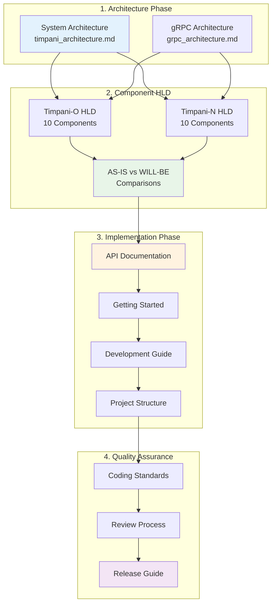

<!--
* SPDX-FileCopyrightText: Copyright 2026 LG Electronics Inc.
* SPDX-License-Identifier: MIT
-->

# TIMPANI Documentation Guide

**Last Updated:** May 12, 2026
**Project:** Eclipse TIMPANI (Rust Migration)
**Version:** Milestone 1 & 2 (gRPC Integration)

---

## 📑 Documentation Overview

This documentation provides a comprehensive guide to the TIMPANI project's migration from C/C++ to Rust, including architecture documentation, high-level design (HLD) comparisons, and implementation details. This structure is designed for **developers and contributors** to understand the system architecture and implementation.

---

## 🎯 Quick Navigation

### 1️⃣ **Architecture Documentation**
📁 [`architecture/`](architecture/)

System architecture, communication protocols, and high-level design documentation.

- [TIMPANI Architecture](architecture/timpani_architecture.md) - Overall system architecture
- [gRPC Architecture](architecture/grpc_architecture.md) - Communication layer design

#### High-Level Design (HLD) Documents
📁 [`architecture/HLD/`](architecture/HLD/)

Component-level HLD documents comparing legacy C/C++ with Rust implementations.

**Timpani-O (Global Orchestrator):**
- [`HLD/timpani-o/`](architecture/HLD/timpani-o/) - 10 component HLD documents
  - 01: SchedInfo Service
  - 02: Fault Service Client
  - 03: D-Bus → gRPC Node Service
  - 04: Global Scheduler
  - 05: Hyperperiod Manager
  - 06: Node Configuration Manager
  - 07: Scheduler Utilities
  - 08: Data Structures
  - 09: Communication Protocols
  - 10: Error Handling
  - [README](architecture/HLD/timpani-o/README.md) - Component overview & migration themes

**Timpani-N (Node Executor):**
- [`HLD/timpani-n/`](architecture/HLD/timpani-n/) - 10 component HLD documents
  - 01: Initialization & Main
  - 02: Configuration Management ✅
  - 03: Time Trigger Core
  - 04: Task Management
  - 05: Real-Time Scheduling
  - 06: Signal Handling
  - 07: eBPF Monitoring
  - 08: Communication (libtrpc → gRPC)
  - 09: Resource Management
  - 10: Data Structures
  - [README](architecture/HLD/timpani-n/README.md) - Component overview & migration status

**🔍 Focus:** Understand system architecture and component-level AS-IS vs WILL-BE comparisons

---

### 2️⃣ **Implementation Documentation**
📁 [`docs/`](docs/)

Detailed developer guides, APIs, and development workflows.

- [API Documentation](docs/api.md) - gRPC services, Rust modules, protobuf schemas
- [Getting Started Guide](docs/getting-started.md) - Build, run, test instructions
- [Development Guide](docs/developments.md) - Contribution workflows
- [Project Structure](docs/structure.md) - Repository organization
- [Release Guide](docs/release.md) - Release procedures

**🔍 Focus:** Learn APIs, build procedures, and development workflows

---

### 3️⃣ **Contribution Guidelines**
📁 [`contribution/`](contribution/)

Development standards, coding rules, and workflow guidelines.

- [Coding Rules](contribution/coding-rule.md) - Rust coding standards
- [GitHub Workflow Guidelines](contribution/guidelines-en.md) - Issue tracking, branching, PR processes

**🔍 Focus:** Follow coding standards and quality guidelines

---

## 📊 Documentation Flow (Architecture → HLD → Implementation)



---

## 🏗️ Repository Structure

```
eclipse_timpani/
├── doc/                          # 📚 All documentation (YOU ARE HERE)
│   ├── README.md                 # This file
│   ├── architecture/             # Architecture & HLD documentation
│   │   ├── timpani_architecture.md
│   │   ├── grpc_architecture.md
│   │   └── HLD/                  # High-Level Design documents
│   │       ├── timpani-o/        # Timpani-O component HLDs
│   │       └── timpani-n/        # Timpani-N component HLDs
│   ├── docs/                     # Implementation guides
│   │   ├── api.md
│   │   ├── getting-started.md
│   │   ├── developments.md
│   │   ├── structure.md
│   │   └── release.md
│   ├── contribution/             # Contribution guidelines
│   │   ├── coding-rule.md
│   │   └── guidelines-en.md
│   └── images/                   # Documentation images
├── timpani_rust/                 # 🦀 Rust implementation
│   ├── timpani-n/                # Node manager (Rust)
│   ├── timpani-o/                # Global orchestrator (Rust)
│   └── test-tools/               # Testing utilities
├── timpani-n/                    # 🔧 Legacy C node manager
├── timpani-o/                    # 🔧 Legacy C++ orchestrator
├── libtrpc/                      # 🔧 Legacy D-Bus RPC library
└── sample-apps/                  # 📦 Sample applications
```

---

## 🔍 Development Checklist

### Phase 1: Architecture Review
- [ ] System architecture documentation is complete and accurate
- [ ] gRPC architecture addresses all communication requirements
- [ ] Component boundaries are clearly defined

### Phase 2: Component HLD Review
- [ ] AS-IS architecture accurately reflects legacy implementation (C/C++)
- [ ] WILL-BE architecture documents Rust implementation status
- [ ] Component HLDs are verified against actual source code
- [ ] Migration notes capture key design decisions

### Phase 3: Implementation Verification
- [ ] API documentation matches protobuf definitions
- [ ] Build process is reproducible
- [ ] Test coverage meets acceptance criteria (>80% for critical paths)
- [ ] Performance benchmarks validate requirements

### Phase 4: Quality Assurance
- [ ] Code follows Rust coding standards (clippy, rustfmt)
- [ ] All PRs follow branching and review guidelines
- [ ] CI/CD pipeline enforces quality gates
- [ ] License compliance verified (SPDX headers present)

---


## 🆘 Support & Contact

### For Technical Questions
- Review the [Getting Started Guide](docs/getting-started.md)
- Check [API Documentation](docs/api.md) for interface details
- Consult [GitHub Issues](https://github.com/eclipse-timpani/timpani/issues)

### For Architecture Clarifications
- Refer to [TIMPANI Architecture](architecture/timpani_architecture.md)
- Review [gRPC Architecture](architecture/grpc_architecture.md)
- Check component HLDs in [HLD/timpani-o/](architecture/HLD/timpani-o/) or [HLD/timpani-n/](architecture/HLD/timpani-n/)

### For Development Queries
- Review architecture documentation: `architecture/` → `HLD/` → `docs/`
- Check test coverage reports: `timpani_rust/target/coverage/`
- Review CI/CD logs: GitHub Actions workflow results

---

## 📜 License

This project is licensed under the **MIT License**.
All files include SPDX license headers as required by Eclipse Foundation guidelines.

```
SPDX-FileCopyrightText: Copyright 2026 LG Electronics Inc.
SPDX-License-Identifier: MIT
```

---

## 🔄 Documentation Maintenance

This documentation is actively maintained and updated with each milestone. Last reviewed: **May 12, 2026**.

For documentation issues or improvements, please file an issue with label `type:documentation`.

---

**Happy Coding!** 🎉
