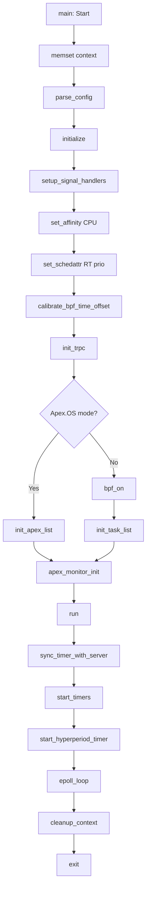

<!--
* SPDX-FileCopyrightText: Copyright 2026 LG Electronics Inc.
* SPDX-License-Identifier: MIT
-->

# LLD: Initialization & Main Entry Point

**Document Information:**
- **Issuing Author:** Eclipse timpani Team
- **Configuration ID:** timpani-n-lld-01
- **Document Status:** Draft
- **Last Updated:** 2026-05-13

---

## Revision History

| Version | Date | Comment | Author | Approver |
|---------|------|---------|--------|----------|
| 0.0b | 2026-05-13 | Updated documentation metadata and standards compliance | LGSI-KarumuriHari | - |
| 0.0a | 2026-02-24 | Initial LLD document creation | Eclipse timpani Team | - |

---

**Component Type:** Application Entry Point
**Responsibility:** Program initialization, main execution loop coordination, graceful shutdown
**Status:** 🔄 Partially Migrated (C → Rust)

---

## Component Overview

The Initialization & Main component serves as the entry point for timpani-n, coordinating the startup sequence, initialization of all subsystems, runtime execution, and graceful shutdown.

---

## AS-IS: C Implementation

### Main Function Flow

**File:** `timpani-n/src/main.c`

```c
int main(int argc, char *argv[])
{
    struct context ctx;
    tt_error_t ret;

    // 1. Zero-initialize context
    memset(&ctx, 0, sizeof(ctx));

    // 2. Parse configuration
    ret = parse_config(argc, argv, &ctx);
    if (ret != TT_SUCCESS) {
        TT_LOG_ERROR("Configuration error: %s", tt_error_string(ret));
        return EXIT_FAILURE;
    }

    // 3. Initialize all subsystems
    ret = initialize(&ctx);
    if (ret != TT_SUCCESS) {
        TT_LOG_ERROR("Initialization failed: %s", tt_error_string(ret));
        goto cleanup;
    }

    // 4. Run main execution loop
    ret = run(&ctx);
    if (ret != TT_SUCCESS) {
        TT_LOG_ERROR("Runtime error: %s", tt_error_string(ret));
    }

cleanup:
    // 5. Cleanup resources
    cleanup_context(&ctx);
    return (ret == TT_SUCCESS) ? EXIT_SUCCESS : EXIT_FAILURE;
}
```

### Initialization Sequence

```c
static tt_error_t initialize(struct context *ctx)
{
    pid_t pid = getpid();

    // 1. Setup signal handlers
    if (setup_signal_handlers(ctx) != TT_SUCCESS) {
        return TT_ERROR_SIGNAL;
    }

    // 2. Set CPU affinity (if configured)
    if (ctx->config.cpu != -1) {
        set_affinity(pid, ctx->config.cpu);
    }

    // 3. Set RT priority (if configured)
    if (ctx->config.prio > 0 && ctx->config.prio <= 99) {
        set_schedattr(pid, ctx->config.prio, SCHED_FIFO);
    }

    // 4. Calibrate BPF time offset
    if (calibrate_bpf_time_offset() != TT_SUCCESS) {
        return TT_ERROR_BPF;
    }

    // 5. Initialize TRPC and get schedule from timpani-o
    if (init_trpc(ctx) != TT_SUCCESS) {
        return TT_ERROR_NETWORK;
    }

    // 6. Initialize task list or Apex.OS monitor
    if (!ctx->config.enable_apex) {
        if (strcmp(ctx->hp_manager.workload_id, "Apex.OS") == 0) {
            init_apex_list(ctx);
        } else {
            bpf_on(handle_sigwait_bpf_event, handle_schedstat_bpf_event, ctx);
            init_task_list(ctx);
        }
    }

    // 7. Initialize Apex.OS Monitor
    apex_monitor_init(ctx);

    return TT_SUCCESS;
}
```

### Runtime Loop

```c
static tt_error_t run(struct context *ctx)
{
    // 1. Synchronize with timpani-o server
    if (sync_timer_with_server(ctx) != TT_SUCCESS) {
        return TT_ERROR_NETWORK;
    }

    // 2. Start task timers
    if (start_timers(ctx) != TT_SUCCESS) {
        return TT_ERROR_TIMER;
    }

    // 3. Start hyperperiod timer
    if (start_hyperperiod_timer(ctx) != TT_SUCCESS) {
        return TT_ERROR_TIMER;
    }

    // 4. Enter main event loop (epoll-based)
    tt_error_t result = epoll_loop(ctx);

    TT_LOG_INFO("Shutdown requested, cleaning up resources...");

    return result;
}
```

### Initialization Order



---

## WILL-BE: Rust Implementation

### Main Function (Current Status: ✅ Implemented)

**File:** `timpani_rust/timpani-n/src/main.rs`

```rust
#[tokio::main]
async fn main() -> anyhow::Result<()> {
    // 1. Parse configuration from command-line arguments
    let config = match Config::from_args() {
        Ok(config) => config,
        Err(e) => {
            eprintln!("Configuration error: {}", e);
            std::process::exit(exit_codes::FAILURE);
        }
    };

    // 2. Initialize tracing/logging
    init_logging(config.log_level);

    // 3. Run the main application logic
    if let Err(e) = run_app(config).await {
        error!("Application error: {}", e);
        std::process::exit(exit_codes::FAILURE);
    }

    Ok(())
}
```

### Application Entry Point (Current Status: 🔄 Structure Only)

**File:** `timpani_rust/timpani-n/src/lib.rs`

```rust
pub async fn run_app(config: Config) -> TimpaniResult<()> {
    info!("Starting timpani-n node executor");
    info!("Configuration: {:?}", config);

    // Initialize context
    let mut ctx = Context::default();
    initialize(&mut ctx)?;

    // Run main loop
    run(&ctx).await?;

    // Cleanup
    cleanup(&ctx)?;

    Ok(())
}

/// Initialize the context (⏸️ TBD - placeholders only)
pub fn initialize(ctx: &mut Context) -> TimpaniResult<()> {
    info!("Initializing timpani-n context...");
    // TODO: Signal handlers
    // TODO: CPU affinity
    // TODO: RT priority
    // TODO: BPF initialization
    // TODO: Connect to timpani-o
    // TODO: Fetch schedule
    warn!("Initialization phase not fully implemented yet");
    Ok(())
}

/// Main runtime loop (⏸️ TBD - not implemented)
pub async fn run(ctx: &Context) -> TimpaniResult<()> {
    info!("Starting runtime loop...");
    // TODO: Timer synchronization
    // TODO: Start timers
    // TODO: Event loop
    warn!("Runtime loop not yet implemented");
    Ok(())
}

/// Cleanup resources (⏸️ TBD)
pub fn cleanup(ctx: &Context) -> TimpaniResult<()> {
    info!("Cleaning up resources...");
    // TODO: Stop timers
    // TODO: Disconnect from server
    // TODO: Cleanup BPF
    Ok(())
}
```

---

## AS-IS vs WILL-BE Comparison

| Aspect | C (AS-IS) | Rust (WILL-BE) |
|--------|-----------|----------------|
| **Entry Point** | `int main(int argc, char *argv[])` | `#[tokio::main] async fn main()` |
| **Config Parsing** | `parse_config()` in C | `Config::from_args()` (clap) ✅ |
| **Logging Init** | Custom `TT_LOG_*` macros | `init_logging()` (tracing) ✅ |
| **Context Init** | `memset(&ctx, 0, ...)` | `Context::default()` ✅ (structure only) |
| **Error Handling** | `tt_error_t` enum + goto cleanup | `Result<T, E>` + `?` operator |
| **Initialization** | Synchronous, manual order | Async-ready, structured ⏸️ |
| **Runtime Loop** | `epoll_loop()` (blocking) | `async fn run()` ⏸️ |
| **Cleanup** | `cleanup_context()` | `cleanup()` ⏸️ |
| **Exit Codes** | `EXIT_SUCCESS/FAILURE` | `exit_codes::SUCCESS/FAILURE` |

---

## Initialization Subsystems

### 1. Signal Handlers (C: ✅ | Rust: ⏸️)
```c
// C implementation
setup_signal_handlers(ctx);
```
- **Purpose:** Register handlers for SIGINT, SIGTERM, SIGALRM
- **Rust Status:** ⏸️ Not implemented

### 2. CPU Affinity (C: ✅ | Rust: ⏸️)
```c
// C implementation
if (ctx->config.cpu != -1) {
    set_affinity(getpid(), ctx->config.cpu);
}
```
- **Purpose:** Bind process to specific CPU core
- **Rust Status:** ⏸️ Not implemented

### 3. RT Priority (C: ✅ | Rust: ⏸️)
```c
// C implementation
if (ctx->config.prio > 0) {
    set_schedattr(getpid(), ctx->config.prio, SCHED_FIFO);
}
```
- **Purpose:** Set real-time scheduling priority
- **Rust Status:** ⏸️ Not implemented

### 4. BPF Calibration (C: ✅ | Rust: ⏸️)
```c
// C implementation
calibrate_bpf_time_offset();
```
- **Purpose:** Sync userspace/kernel timestamps
- **Rust Status:** ⏸️ Not implemented

### 5. TRPC Connection (C: ✅ | Rust: ⏸️)
```c
// C implementation
init_trpc(ctx);  // Connect to timpani-o via D-Bus
```
- **Purpose:** Establish connection to orchestrator
- **Rust Status:** ⏸️ Planned (will use gRPC, not D-Bus)

### 6. Task List Init (C: ✅ | Rust: ⏸️)
```c
// C implementation
bpf_on(...);
init_task_list(ctx);
```
- **Purpose:** Load eBPF programs, initialize task list
- **Rust Status:** ⏸️ Not implemented

---

## Error Handling Flow

### C Error Handling
```c
ret = initialize(&ctx);
if (ret != TT_SUCCESS) {
    TT_LOG_ERROR("Initialization failed: %s", tt_error_string(ret));
    goto cleanup;
}

ret = run(&ctx);
if (ret != TT_SUCCESS) {
    TT_LOG_ERROR("Runtime error: %s", tt_error_string(ret));
}

cleanup:
    cleanup_context(&ctx);
    return (ret == TT_SUCCESS) ? EXIT_SUCCESS : EXIT_FAILURE;
```

### Rust Error Handling
```rust
initialize(&mut ctx)?;  // Early return on error

run(&ctx).await.map_err(|e| {
    error!("Runtime error: {}", e);
    e
})?;

cleanup(&ctx)?;

Ok(())
```

---

## Migration Notes

### What Changed
1. **Async Runtime:** Tokio `#[tokio::main]` for future gRPC support
2. **Error Propagation:** `?` operator instead of goto cleanup
3. **Logging:** `tracing` crate instead of custom macros
4. **Config:** Clap-based CLI instead of getopt

### What Will Stay the Same
1. **Initialization Order:** Same subsystem dependencies
2. **Three Phases:** Parse → Initialize → Run → Cleanup
3. **Exit Codes:** SUCCESS=0, FAILURE=1

### Still To Implement (⏸️)
- Signal handlers
- CPU affinity setting
- RT priority configuration
- BPF initialization
- TRPC/gRPC connection
- Task list initialization
- Timer synchronization
- Main event loop

---

**Document Version:** 1.0
**Last Updated:** May 12, 2026
**Status:** 🔄 Partial (CLI + Config ✅, Runtime ⏸️)
**Verified Against:** `timpani-n/src/main.c`, `timpani_rust/timpani-n/src/main.rs`
