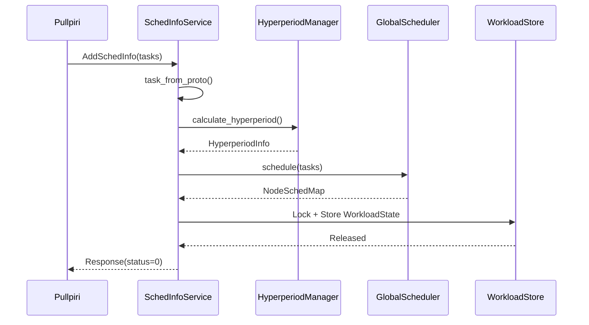

<!--
* SPDX-FileCopyrightText: Copyright 2026 LG Electronics Inc.
* SPDX-License-Identifier: MIT
-->

# LLD: SchedInfoService Component

**Document Information:**
- **Issuing Author:** Eclipse timpani Team
- **Configuration ID:** timpani-o-lld-01
- **Document Status:** Draft
- **Last Updated:** 2026-05-13

---

## Revision History

| Version | Date | Comment | Author | Approver |
|---------|------|---------|--------|----------|
| 0.0b | 2026-05-13 | Updated documentation metadata and standards compliance | LGSI-KarumuriHari | - |
| 0.0a | 2026-02-24 | Initial LLD document creation | Eclipse timpani Team | - |

---

**Component Type:** gRPC Service
**Responsibility:** Receive and process workload schedules from Pullpiri orchestrator
**Status:** ✅ Migrated (C++ → Rust)

## Component Overview

The SchedInfoService component acts as the entry point for workload submissions from the Pullpiri orchestrator. It receives scheduling requests via gRPC, validates them, processes them through the global scheduler, and returns success/failure responses.

---

## As-Is: C++ Implementation

### Class Structure

```cpp
class SchedInfoServiceImpl : public SchedInfoService::Service {
public:
    explicit SchedInfoServiceImpl(std::shared_ptr<NodeConfigManager> node_config_manager);

    Status AddSchedInfo(ServerContext* context,
                       const SchedInfo* request,
                       Response* reply) override;

    SchedInfoMap GetSchedInfoMap() const;
    const HyperperiodInfo* GetHyperperiodInfo(const std::string& workload_id) const;
};
```

### Responsibilities (C++)

1. **Receive** scheduling information from Piccolo via gRPC
2. **Validate** scheduling requests
3. **Process** scheduling information through GlobalScheduler
4. **Manage** hyperperiod calculations
5. **Return** appropriate responses

### Key Features (C++)

- **Thread Safety:** Uses shared mutexes for concurrent access
- **Validation:** Comprehensive input validation and resource checking
- **Error Handling:** Detailed error reporting with appropriate status codes
- **Integration:** Seamless integration with GlobalScheduler and NodeConfigManager

### Configuration (C++)

- **Default Port:** 50052
- **Protocol:** gRPC over HTTP/2
- **Message Format:** Protocol Buffers (schedinfo.proto)

---

## Will-Be: Rust Implementation

### Module Structure

```rust
// File: timpani_rust/timpani-o/src/grpc/schedinfo_service.rs

#[derive(Clone)]
pub struct SchedInfoServiceImpl {
    scheduler: Arc<GlobalScheduler>,
    workload_store: WorkloadStore,
    fault_notifier: Arc<dyn FaultNotifier>,
}
```

### Responsibilities (Rust)

1. **Convert** proto `TaskInfo` list → internal `Vec<Task>`
2. **Calculate** hyperperiod (LCM of all task periods)
3. **Run** `GlobalScheduler` to assign tasks to nodes and CPUs
4. **Acquire** `WorkloadStore` lock, cancel previous workload's sync barrier
5. **Store** the new `WorkloadState`, release lock

### Implementation (Rust)

```rust
#[tonic::async_trait]
impl SchedInfoService for SchedInfoServiceImpl {
    async fn add_sched_info(
        &self,
        request: Request<SchedInfo>,
    ) -> Result<Response<ProtoResponse>, Status> {
        // 1. Extract workload_id and tasks
        let req = request.into_inner();
        let workload_id = req.workload_id.clone();

        // 2. Convert proto tasks to internal Task structs
        let tasks: Vec<Task> = req.tasks.iter()
            .map(|t| task_from_proto(t, &workload_id))
            .collect();

        // 3. Calculate hyperperiod using HyperperiodManager
        let hyperperiod_info = HyperperiodManager::new()
            .calculate_hyperperiod(&workload_id, &tasks)?;

        // 4. Run GlobalScheduler to assign tasks to nodes
        let assignments = self.scheduler.schedule(tasks)?;

        // 5. Store workload state and cancel old barrier
        // ...

        Ok(Response::new(ProtoResponse { status: 0 }))
    }
}
```

### Key Features (Rust)

- **Async/Await:** Fully async implementation using Tokio
- **Type Safety:** Compile-time type checking via Tonic + Protobuf
- **Memory Safety:** No shared mutexes - uses Arc for shared ownership
- **Error Handling:** Result<> types with structured errors
- **Logging:** Structured logging via `tracing` crate

### Configuration (Rust)

- **Default Port:** 50052 (configurable via `--sinfoport` CLI arg)
- **Protocol:** gRPC over HTTP/2
- **Message Format:** Protocol Buffers (schedinfo.proto)

---

## As-Is vs Will-Be Comparison

| Aspect | C++ (As-Is) | Rust (Will-Be) |
|--------|-------------|----------------|
| **Concurrency Model** | Shared mutexes, manual locking | Arc + async/await, lock-free where possible |
| **Error Handling** | Status codes, exceptions | Result<T, E> types, no exceptions |
| **Memory Management** | `std::shared_ptr<>`, manual lifetime | Arc<>, compile-time borrow checking |
| **Type Safety** | Runtime protobuf validation | Compile-time protobuf validation |
| **Threading** | OS threads with mutexes | Tokio async runtime |
| **State Management** | Shared mutable state | Immutable state with Arc, WorkloadStore |
| **Logging** | `TLOG_DEBUG`, custom macros | `tracing` crate, structured logging |
| **Dependency Injection** | Constructor injection | `Arc<dyn Trait>` injection |
| **Function Signature** | `Status AddSchedInfo(...)` | `async fn add_sched_info(...) -> Result<>` |

---

## Design Decisions

### D-SCHED-001: WorkloadStore Design

**C++ Approach:**
- SchedInfoServiceImpl maintains internal `SchedInfoMap`
- Accessed via `GetSchedInfoMap()` method
- Protected by shared mutexes

**Rust Approach:**
- Centralized `WorkloadStore` (Arc-wrapped)
- Shared across SchedInfoService and NodeService
- Enables coordinated barrier cancellation

**Rationale:** In Rust, the barrier synchronization logic (SyncTimer) needs to be cancelled when a new workload arrives. This requires shared state between SchedInfoService and NodeService, hence WorkloadStore.

---

### D-SCHED-002: Async vs Sync RPC

**C++ Approach:**
- Synchronous gRPC handler
- Blocking I/O

**Rust Approach:**
- Fully async using `#[tonic::async_trait]`
- Non-blocking I/O via Tokio

**Rationale:** Rust's Tokio runtime allows thousands of concurrent connections without OS thread overhead. The async model is more scalable and matches Tonic's design.

---

### D-SCHED-003: FaultNotifier Injection

**C++ Implementation:**
- FaultServiceClient is a singleton (`GetInstance()`)
- Accessed globally

**Rust Implementation:**
```rust
pub struct SchedInfoServiceImpl {
    fault_notifier: Arc<dyn FaultNotifier>,
}
```

**Rationale:** Dependency injection via trait objects (`dyn FaultNotifier`) allows:
- Unit testing with mock notifiers
- No global state
- Clear ownership and lifetimes

---

## Data Flow

### C++ Data Flow

```
Pullpiri (gRPC client)
  ↓
SchedInfoServiceImpl::AddSchedInfo()
  ↓
GlobalScheduler::ProcessScheduleInfo()
  ↓
HyperperiodManager::CalculateHyperperiod()
  ↓
Internal SchedInfoMap (mutexed)
  ↓
Return Response
```

### Rust Data Flow



---

## Proto Message Definitions

### SchedInfo Message

```protobuf
message SchedInfo {
    string workload_id = 1;
    repeated TaskInfo tasks = 2;
}

message TaskInfo {
    string name = 1;
    int32 priority = 2;
    int32 policy = 3;
    uint64 cpu_affinity = 4;
    int32 period = 5;
    int32 release_time = 6;
    int32 runtime = 7;
    int32 deadline = 8;
    string node_id = 9;
    int32 max_dmiss = 10;
}

message Response {
    int32 status = 1;
}
```

---

## Error Handling

### C++ Error Handling

```cpp
Status AddSchedInfo(...) {
    if (!ValidateInput()) {
        return Status(StatusCode::INVALID_ARGUMENT, "Invalid task");
    }
    try {
        ProcessSchedule();
        return Status::OK;
    } catch (const std::exception& e) {
        return Status(StatusCode::INTERNAL, e.what());
    }
}
```

### Rust Error Handling

```rust
async fn add_sched_info(...) -> Result<Response<ProtoResponse>, Status> {
    // Validation via type system (proto parsing)
    let tasks = req.tasks.iter()
        .map(|t| task_from_proto(t, &workload_id))
        .collect();

    // Explicit Result propagation
    let hyperperiod_info = match hp_mgr.calculate_hyperperiod(&workload_id, &tasks) {
        Ok(info) => info,
        Err(e) => {
            error!("Hyperperiod calculation failed: {}", e);
            return Ok(Response::new(ProtoResponse { status: -1 }));
        }
    };

    // No exceptions - all errors are Result<>
    Ok(Response::new(ProtoResponse { status: 0 }))
}
```

---

## Testing Approach

### C++ Testing

- Manual integration tests
- Limited unit test coverage
- Requires running gRPC server

### Rust Testing

```rust
#[cfg(test)]
mod tests {
    use super::*;

    #[tokio::test]
    async fn test_add_sched_info_success() {
        let node_config = Arc::new(NodeConfigManager::default());
        let store = new_workload_store();
        let notifier = Arc::new(MockFaultNotifier::new());

        let service = SchedInfoServiceImpl::new(node_config, store, notifier);

        let request = Request::new(SchedInfo {
            workload_id: "test_workload".to_string(),
            tasks: vec![/* ... */],
        });

        let response = service.add_sched_info(request).await;
        assert!(response.is_ok());
    }
}
```

**Improvements:**
- Unit tests using mock dependencies (`MockFaultNotifier`)
- Tokio test runtime (`#[tokio::test]`)
- No external server required

---

## Migration Notes

### What Changed

1. **Language:** C++ → Rust
2. **Async Model:** Sync gRPC → Async Tonic
3. **State Management:** Shared mutex → WorkloadStore (Arc)
4. **Error Handling:** Exceptions → Result<>
5. **Dependency Injection:** Singleton → Arc<dyn Trait>

### What Stayed the Same

1. **gRPC Protocol:** Same SchedInfo protobuf messages
2. **Port:** 50052 (default)
3. **API Contract:** AddSchedInfo RPC signature
4. **Business Logic:** Workload validation and scheduling flow

---

**Document Version:** 1.0
**Last Updated:** May 12, 2026
**Status:** ✅ Complete
**Verified Against:** `timpani_rust/timpani-o/src/grpc/schedinfo_service.rs` (actual implementation)
