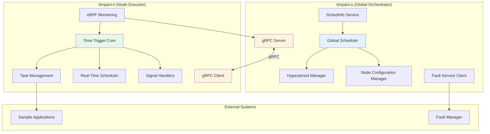
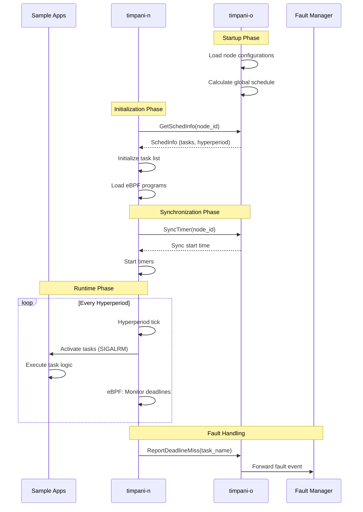
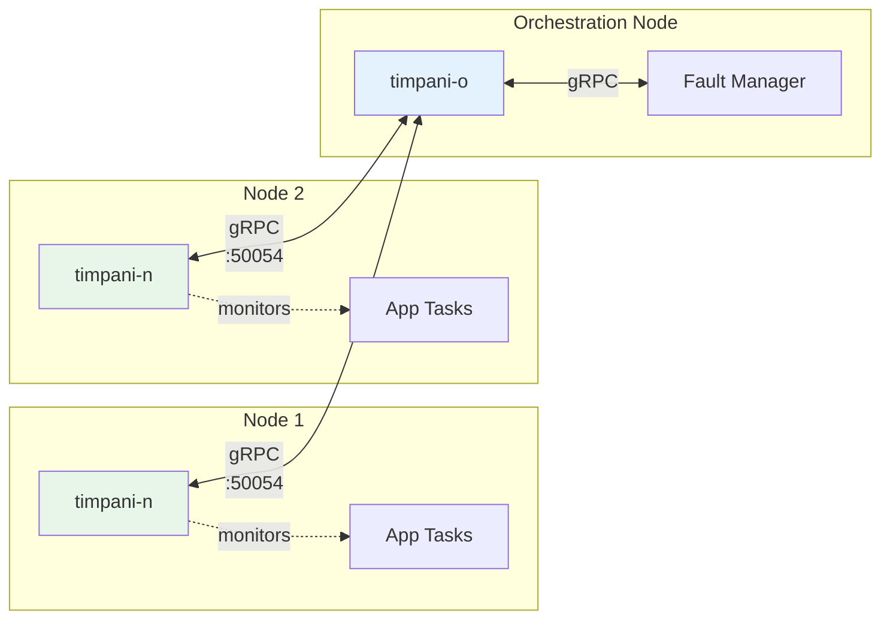

<!--
* SPDX-FileCopyrightText: Copyright 2026 LG Electronics Inc.
* SPDX-License-Identifier: MIT
-->

# timpani System Architecture

**Document Information:**
- **Issuing Author:** Eclipse timpani Team
- **Configuration ID:** timpani-arch-system
- **Document Status:** Published
- **Last Updated:** 2026-05-13

---

## Revision History

| Version | Date | Comment | Author | Approver |
|---------|------|---------|--------|----------|
| 0.0a | 2026-05-13 | Initial system architecture documentation | Eclipse timpani Team | - |

---

**Document Version:** 1.0
**Last Updated:** May 12, 2026
**Status:** Living Document

---

## System Overview

timpani is a **distributed real-time task orchestration framework** designed for time-triggered systems. It consists of two primary components:

- **timpani-o (Orchestrator):** Global scheduler that manages workloads across multiple nodes
- **timpani-n (Node):** Local executor that runs time-triggered tasks with real-time guarantees

---

## Component Architecture

---

## timpani-o Components

| Component | Responsibility | Implementation |
|-----------|---------------|----------------|
| **Global Scheduler** | Workload scheduling, feasibility analysis | C++ → Rust ✅ |
| **Hyperperiod Manager** | LCM calculation, cycle management | C++ → Rust ✅ |
| **Node Configuration Manager** | Multi-node configuration | C++ → Rust ✅ |
| **SchedInfo Service** | Schedule distribution via gRPC | C++ → Rust ✅ |
| **Fault Service Client** | Deadline miss reporting | C++ → Rust ✅ |
| **gRPC Server** | Node communication (port 50054) | D-Bus → gRPC ✅ |

**Detailed Documentation:** [LLD/timpani-o/](LLD/timpani-o/)

---

## timpani-n Components

| Component | Responsibility | Implementation |
|-----------|---------------|----------------|
| **Time Trigger Core** | Event loop, hyperperiod coordination | C → Rust 🔄 |
| **Task Management** | Task lifecycle, activation scheduling | C → Rust ⏸️ |
| **Real-Time Scheduler** | CPU affinity, SCHED_FIFO priority | C → Rust ⏸️ |
| **eBPF Monitoring** | Deadline miss detection (kernel) | C → Rust ⏸️ |
| **Signal Handlers** | SIGALRM, task activation signals | C → Rust ⏸️ |
| **Configuration** | CLI parsing, validation | C → Rust ✅ |
| **gRPC Client** | Communication with timpani-o | libtrpc → gRPC 🔄 |

**Detailed Documentation:** [LLD/timpani-n/](LLD/timpani-n/)

**Legend:** ✅ Complete | 🔄 In Progress | ⏸️ Not Started

---

## Communication Flow

---

## Technology Stack

### Legacy (C/C++)
- **Communication:** D-Bus + libtrpc (custom serialization)
- **Build System:** CMake
- **Monitoring:** libbpf (eBPF)
- **Concurrency:** epoll event loop

### Rust Migration
- **Communication:** gRPC (Tonic) + Protobuf
- **Build System:** Cargo
- **Async Runtime:** Tokio
- **Monitoring:** aya (eBPF in Rust, planned)
- **CLI:** Clap
- **Logging:** tracing

---

## Deployment Architecture

---

## Key Design Patterns

### 1. Time-Triggered Architecture
- **Hyperperiod:** LCM of all task periods
- **Cyclic Scheduling:** Tasks activated at fixed intervals
- **Deadline Monitoring:** eBPF tracks rt_sigtimedwait syscalls

### 2. Distributed Coordination
- **Centralized Scheduling:** timpani-o computes global schedule
- **Decentralized Execution:** timpani-n executes local schedule
- **Synchronization:** Coordinated start time across nodes

### 3. Fault Tolerance
- **Deadline Miss Detection:** eBPF monitors at kernel level
- **Fault Reporting:** gRPC streaming from nodes to orchestrator
- **Fault Management:** Integration with external fault manager

---

## References

- **Component LLD:** [LLD/timpani-o/](LLD/timpani-o/), [LLD/timpani-n/](LLD/timpani-n/)
- **gRPC Architecture:** [grpc_architecture.md](grpc_architecture.md)
- **API Documentation:** [../docs/api.md](../docs/api.md)
- **Getting Started:** [../docs/getting-started.md](../docs/getting-started.md)

---

**Document Version:** 1.0
**Verified Against:** Component LLD documents, source code (timpani_rust/, timpani-n/, timpani-o/)

