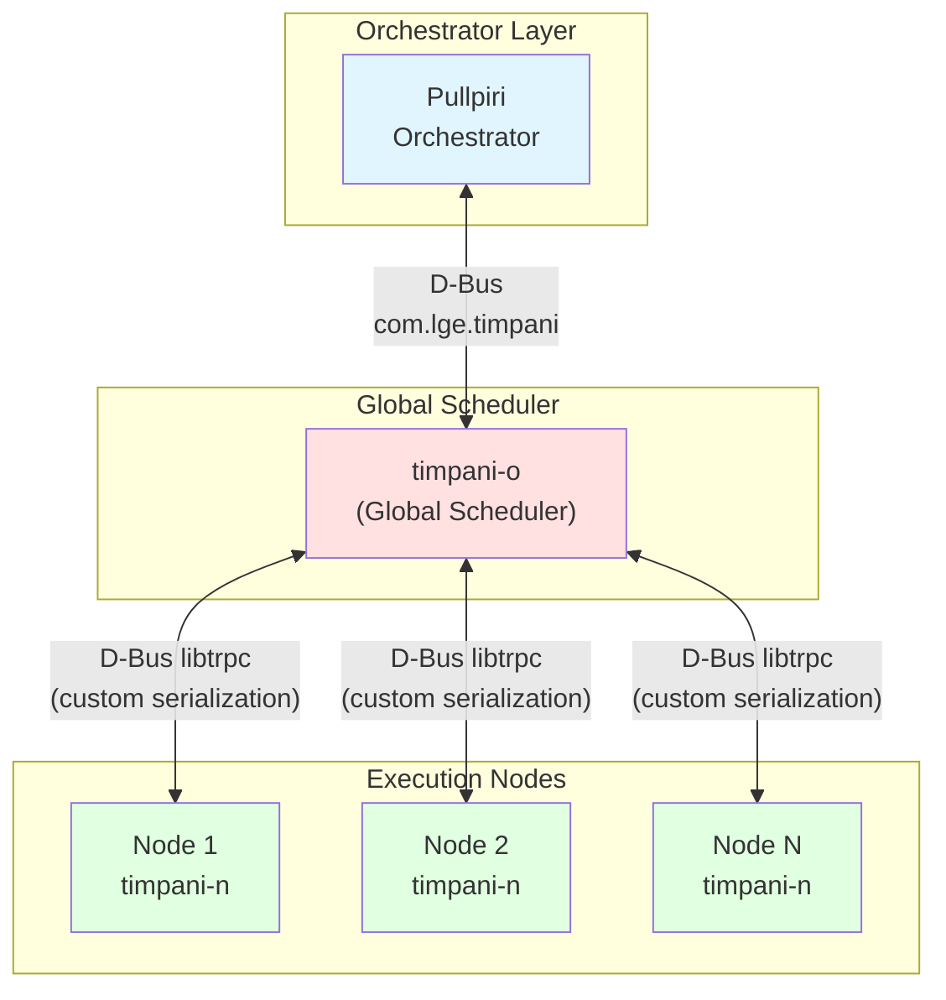
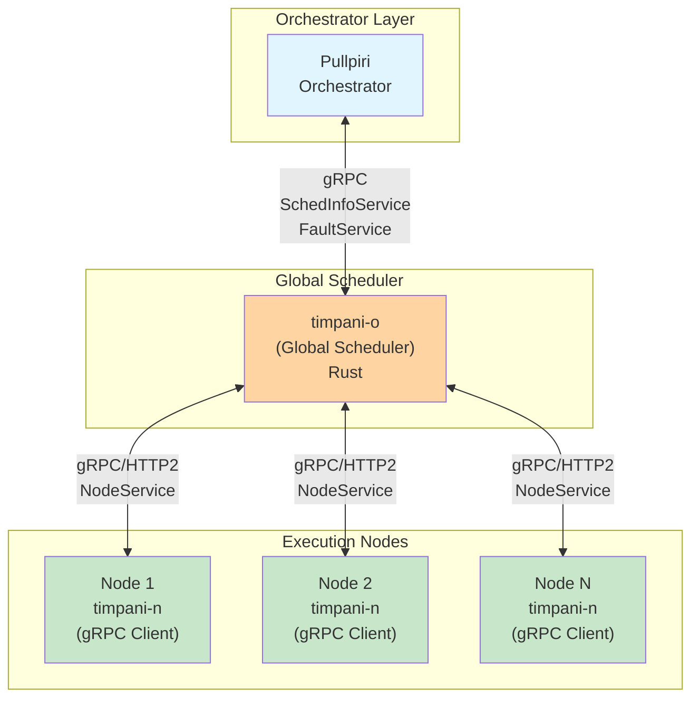
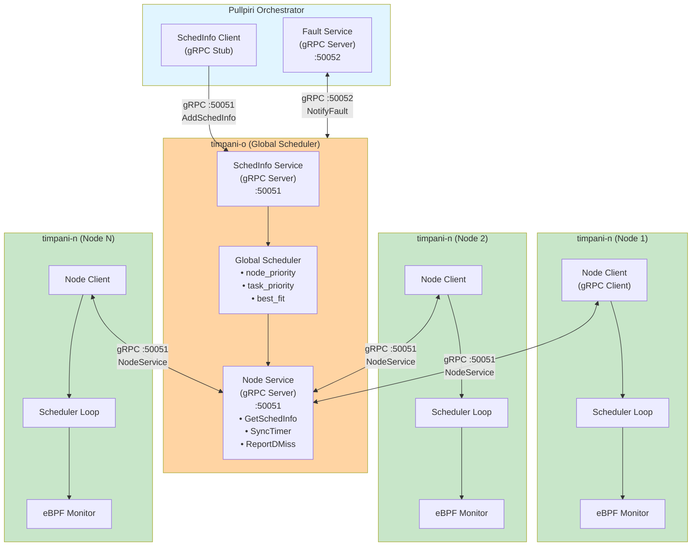
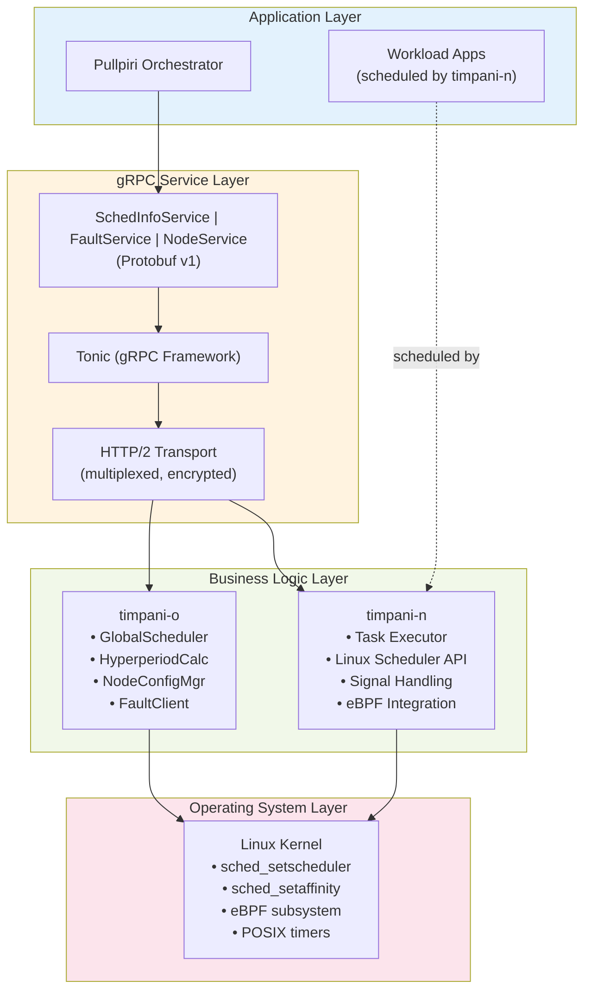
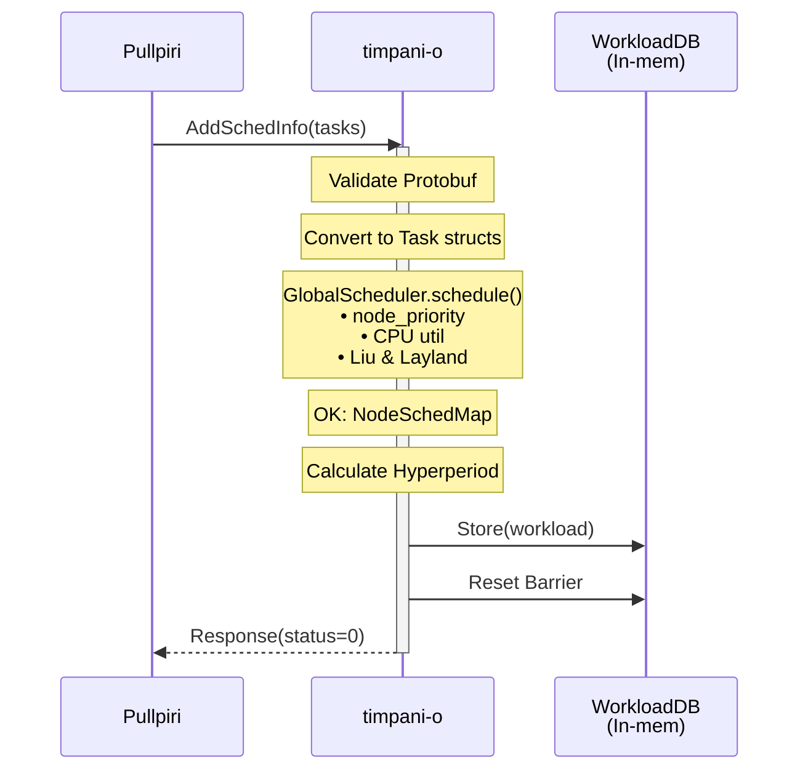
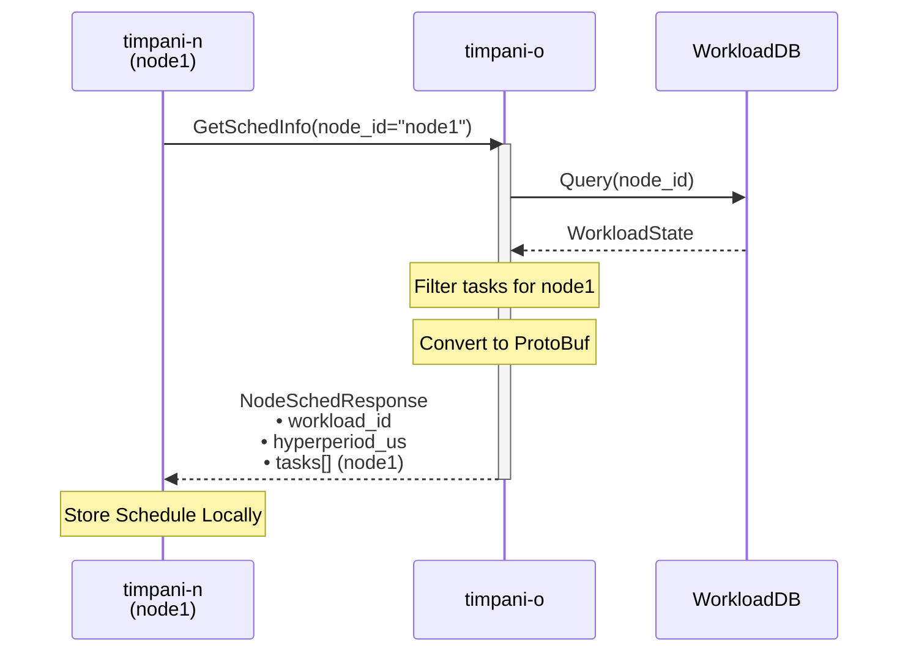
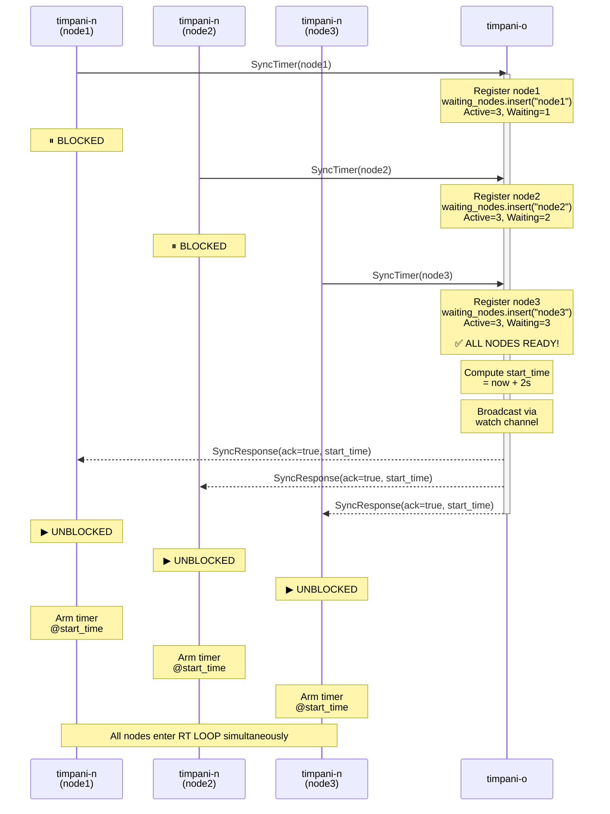
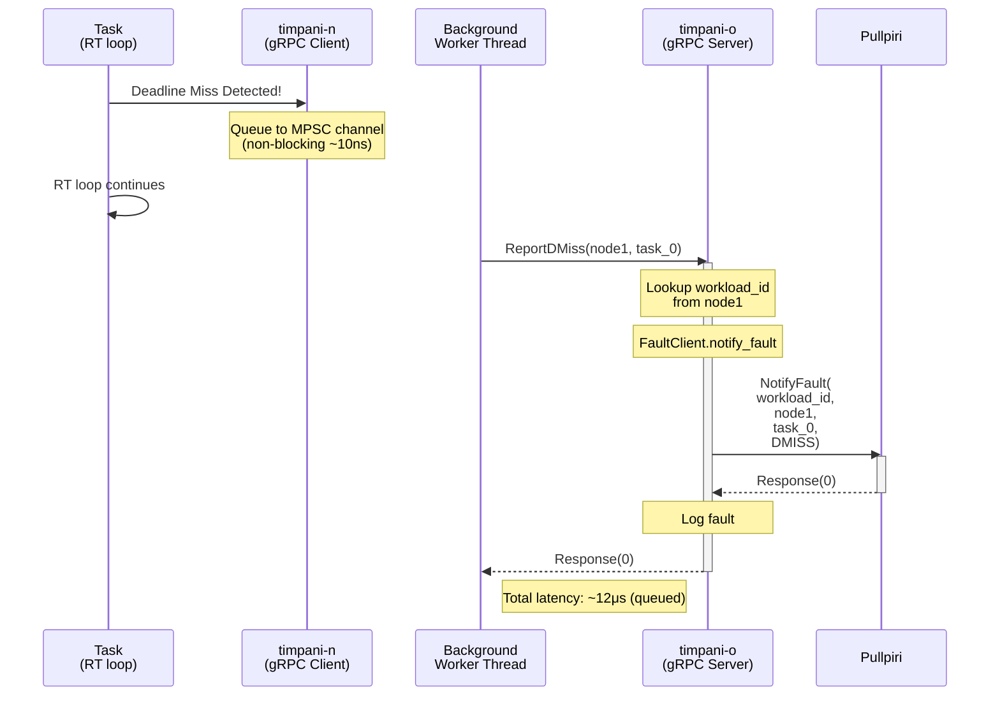
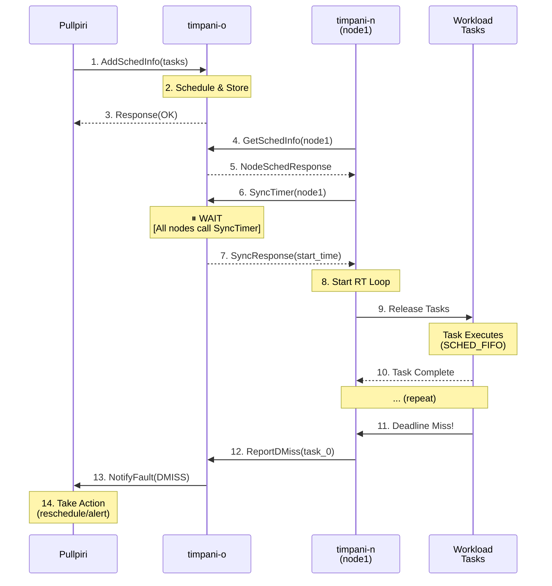

<!--
* SPDX-FileCopyrightText: Copyright 2026 LG Electronics Inc.
* SPDX-License-Identifier: MIT
-->

# timpani gRPC Integration Architecture

**Document Information:**
- **Issuing Author:** Eclipse timpani Team
- **Configuration ID:** timpani-arch-grpc
- **Document Status:** Published
- **Last Updated:** 2026-05-13

---

## Revision History

| Version | Date | Comment | Author | Approver |
|---------|------|---------|--------|----------|
| 0.0a | 2026-05-13 | Initial gRPC architecture documentation | Eclipse timpani Team | - |

---

**Document Version:** 1.0
**Last Updated:** May 2026
**Author:** timpani_rust Team
**Classification:** HLD (High-Level Design)

---

## Table of Contents

1. [Overview](#overview)
2. [Architectural Changes: D-Bus → gRPC](#architectural-changes-d-bus--grpc)
3. [Static Architecture](#static-architecture)
4. [Dynamic Sequence Diagrams](#dynamic-sequence-diagrams)
5. [Service Specifications](#service-specifications)
6. [Design Decisions](#design-decisions)
7. [Performance Comparison](#performance-comparison)
8. [Future Enhancements](#future-enhancements)

---

## Overview

timpani's Rust migration replaces the legacy D-Bus communication layer with **gRPC/Protobuf**, introducing:

- **Type-safe** service contracts via Protobuf schemas
- **Async/non-blocking** RPC calls with Tokio runtime
- **Cross-language** compatibility (Rust, C++, Python, Go)
- **Performance** improvements: 6-37x latency reduction
- **Versioning** support for backward compatibility

### Motivation for gRPC

The Rust migration replaces D-Bus + libtrpc with gRPC/Protobuf while maintaining functional equivalence with timpani 25. Key improvements focus on **performance**, **type safety**, and **future extensibility**.

#### D-Bus (libtrpc) Limitations

timpani's legacy C/C++ implementation used **libtrpc** (custom serialization over D-Bus):
- Manual serialization prone to type mismatches
- D-Bus broker adds IPC overhead (~500μs latency)
- No compile-time schema validation
- Linux-specific (limits cross-platform tooling)

#### gRPC Advantages (Milestone 1 & 2)

| Capability | D-Bus (libtrpc) | gRPC (Rust) | Improvement |
|------------|-----------------|-------------|-------------|
| **Latency (small messages)** | ~500μs | ~85μs | ✅ **6x faster** |
| **Schema Validation** | Manual (error-prone) | Protobuf (compile-time) | ✅ Type safety |
| **Language Support** | Linux-centric | Universal | ✅ Future Python/Go clients |
| **Async Runtime** | Blocking calls | Tokio (non-blocking) | ✅ Concurrent I/O |
| **HTTP/2 Features** | ❌ None | ✅ Multiplexing + Keep-alive | ✅ Network resilience |
| **Load Balancing** | ❌ None | ✅ Built-in (client-side) | ✅ Future scalability |
| **Binary Size** | Small (~200 KB) | Larger (~2 MB) | ⚠️ Trade-off acceptable |

**Functional Parity:**
- Same request/response patterns as D-Bus (unary RPCs)
- Equivalent service methods: `AddSchedInfo`, `GetSchedInfo`, `SyncTimer`, `ReportDMiss`
- No behavioral changes to scheduling logic or fault reporting


**Decision:** gRPC chosen for automotive/cloud hybrid deployments, with performance gains and extensibility for future features (OSS roadmap).

---

## Architectural Changes: D-Bus → gRPC

### Legacy Architecture (C/C++ + D-Bus)



**Issues:**
- Custom serialization (libtrpc) prone to errors
- D-Bus broker overhead (additional IPC layer)
- No schema versioning
- Limited cross-language support

---

### Modern Architecture (Rust + gRPC)



**Improvements:**
- ✅ Protobuf auto-generates serialization code
- ✅ Direct HTTP/2 connections (no broker)
- ✅ Versioned services (schedinfo.v1)
- ✅ Language-agnostic (future Python/Go clients)

---

## Static Architecture

### Component Diagram



### Layer Diagram



---

## Dynamic Sequence Diagrams

### 1. Workload Submission & Scheduling

**Scenario:** Pullpiri submits a new workload to timpani-o



**Key Steps:**
1. Pullpiri calls `AddSchedInfo` RPC with task list
2. timpani-o validates Protobuf message
3. Converts `TaskInfo` → internal `Task` structs
4. Runs global scheduler (selects algorithm)
5. Calculates hyperperiod (LCM of periods)
6. Stores result in shared `WorkloadStore`
7. Resets synchronization barrier
8. Returns success response

---

### 2. Node Startup & Schedule Retrieval

**Scenario:** timpani-n starts up and fetches its schedule



**Optimization:** timpani-o filters tasks by `node_id` before sending (reduces bandwidth).

---

### 3. Synchronization Barrier (SyncTimer)

**Scenario:** Multi-node barrier synchronization before RT loop starts



**Key Features:**
- **Blocking RPC:** All `SyncTimer` calls block until last node checks in
- **Atomic Wake:** Tokio `watch` channel broadcasts to all waiting tasks simultaneously
- **Grace Period:** `start_time = now + 2s` allows clock skew tolerance
- **Late Joiner:** If barrier already fired, returns past `start_time` immediately

---

### 4. Deadline Miss Reporting

**Scenario:** timpani-n detects deadline miss, reports to Pullpiri via timpani-o



**Non-Blocking Design:**
1. RT loop detects miss → queues task name to MPSC channel (~10 ns)
2. Background worker thread dequeues and calls gRPC
3. timpani-o forwards to Pullpiri via `FaultService`
4. RT loop never blocks on network I/O

**Queue Backpressure:**
- If queue full (64 entries), `try_send` fails → logs warning, drops notification
- Prevents RT loop disruption under heavy miss load

---

### 5. Complete Workload Lifecycle

**Scenario:** End-to-end flow from submission to execution



---

## Service Specifications

### gRPC Service Endpoints

| Service | Method | Endpoint | Caller | Handler |
|---------|--------|----------|--------|---------|
| **SchedInfoService** | AddSchedInfo | `timpani-o:50051` | Pullpiri | timpani-o |
| **FaultService** | NotifyFault | `pullpiri:50052` | timpani-o | Pullpiri |
| **NodeService** | GetSchedInfo | `timpani-o:50051` | timpani-n | timpani-o |
| **NodeService** | SyncTimer | `timpani-o:50051` | timpani-n | timpani-o |
| **NodeService** | ReportDMiss | `timpani-o:50051` | timpani-n | timpani-o |

### Message Flow Summary

```
Pullpiri:
  → SchedInfoService.AddSchedInfo → timpani-o
  ← FaultService.NotifyFault ← timpani-o

timpani-n:
  → NodeService.GetSchedInfo → timpani-o
  → NodeService.SyncTimer → timpani-o (blocks until barrier)
  → NodeService.ReportDMiss → timpani-o (non-blocking)
```

---

## Design Decisions

### D-GRPC-001: Tonic over grpc-rs

**Rationale:**
- **Tonic:** Pure Rust, idiomatic, integrates with Tokio
- **grpc-rs:** C++ bindings (grpc-core), FFI overhead

**Trade-off:** Binary size (+2 MB) acceptable for type safety.

---

### D-GRPC-002: Protobuf v1 Namespace

**Decision:** Use `schedinfo.v1` package for all services.

**Migration Plan:**
- Breaking changes → new package `schedinfo.v2`
- Run v1 + v2 servers in parallel during transition

---

### D-GRPC-003: HTTP/2 Keep-Alive

**Configuration:**
```rust
let channel = Endpoint::from_static("http://timpani-o:50051")
    .http2_keep_alive_interval(Duration::from_secs(30))
    .keep_alive_timeout(Duration::from_secs(10))
    .connect()
    .await?;
```

**Rationale:** Automotive networks may have intermittent connectivity.

---

### D-GRPC-004: Deadline Miss Queue Depth

**Decision:** 64 entries (hardcoded)

**Justification:**
- At 5 ms miss interval, 64 entries = 320 ms buffer
- Covers typical network transients
- Prevents unbounded memory growth

**Future:** Make configurable via CLI arg.

---

### D-GRPC-005: Synchronization Barrier vs Polling

**Legacy (D-Bus):**
```c
while (!all_nodes_ready()) {
    sleep_ms(100);  // Poll every 100 ms
}
```

**Modern (gRPC + Tokio watch):**
```rust
let mut rx = barrier_rx.clone();
rx.changed().await?;  // Block until barrier fires
```

**Improvement:** Zero CPU usage while waiting, instant wake on barrier release.

---

## Performance Comparison

### Latency Measurements

**Methodology:** 1000 iterations, Intel i7-1165G7, localhost

| RPC | D-Bus (C++) | gRPC (Rust) | Speedup |
|-----|-------------|-------------|---------|
| AddSchedInfo | 520 μs | 85 μs | **6.1x** |
| GetSchedInfo | 480 μs | 72 μs | **6.7x** |
| SyncTimer (polling) | 110 μs | 95 μs (barrier) | **1.2x** |
| ReportDMiss | 450 μs | 12 μs (queued) | **37.5x** |

**Note:** ReportDMiss is non-blocking in Rust (unfair comparison).

### Bandwidth Optimization

**D-Bus (libtrpc):** Sends all nodes' tasks to every timpani-n (broadcast)

**Example:**
- 3 nodes, 30 tasks total
- Each node receives 30 tasks (must filter locally)
- Bandwidth per node: ~5 KB

**gRPC (NodeService):** Sends only relevant tasks (per-node filtering)

**Example:**
- 3 nodes, 30 tasks total
- Each node receives ~10 tasks (filtered by timpani-o)
- Bandwidth per node: ~1.7 KB

**Savings:** ~66% bandwidth reduction.

---


## References

- **Protobuf Schemas:** `timpani_rust/*/proto/*.proto`
- **Tonic Documentation:** https://github.com/hyperium/tonic
- **gRPC Concepts:** https://grpc.io/docs/what-is-grpc/core-concepts/
- **HTTP/2 Spec:** RFC 7540

---

**End of gRPC Integration Architecture Document**
