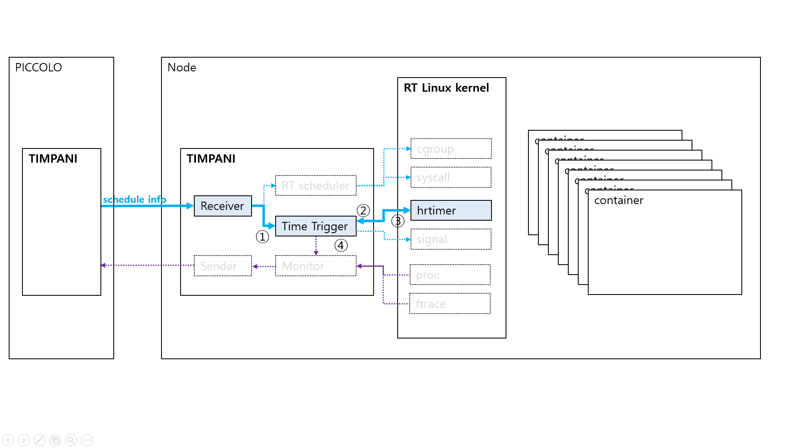
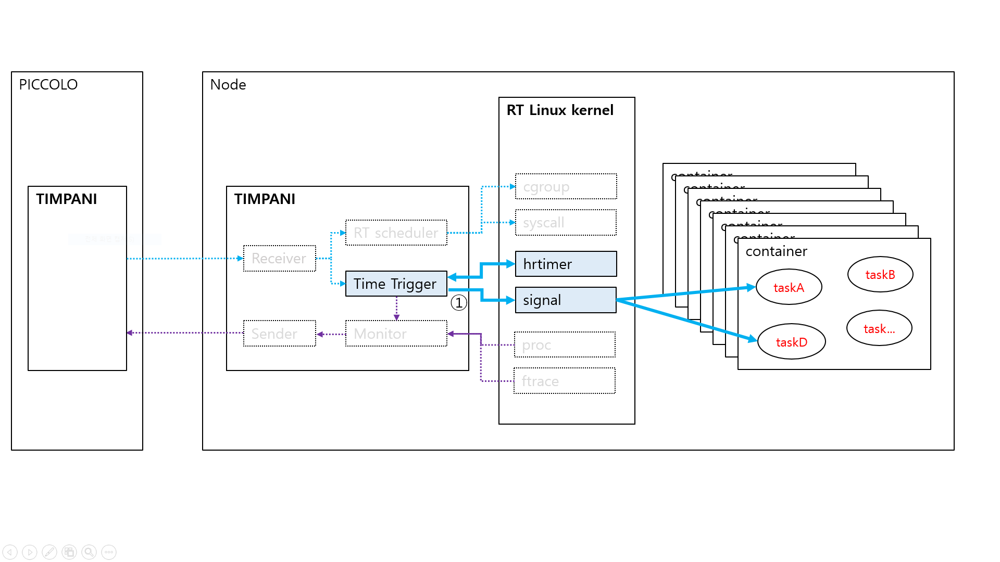
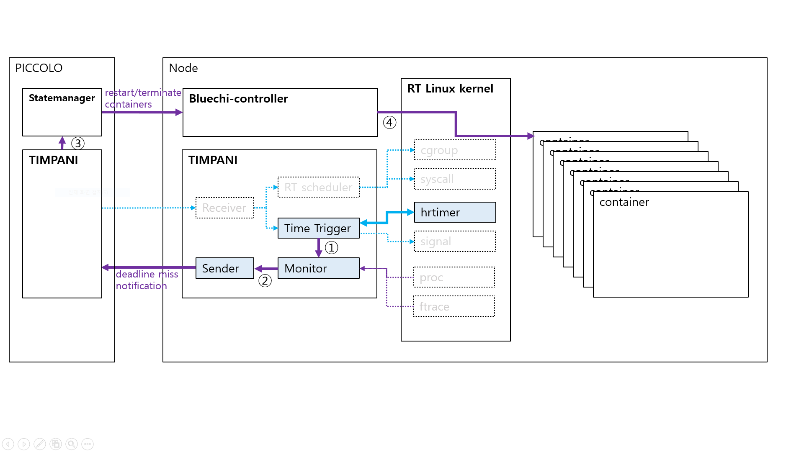

<!--
* SPDX-FileCopyrightText: Copyright 2026 LG Electronics Inc.
* SPDX-License-Identifier: MIT
-->

# Project Structure

This document describes the current structure of the TIMPANI repository. All files and folders listed here are considered stable and will remain untouched in the future, except for the `timpani_rust` folder, which will be the sole focus of ongoing development.

---





## Current Repository Layout

```bash
TIMPANI/
├── LICENSE
├── README.md
├── doc/
│   ├── README.md                    # Documentation guide
│   ├── architecture/
│   │   ├── timpani_architecture.md  # System architecture
│   │   ├── grpc_architecture.md     # gRPC design
│   │   └── HLD/                     # High-Level Design documents
│   │       ├── timpani-o/           # Timpani-O component HLDs (10 docs)
│   │       └── timpani-n/           # Timpani-N component HLDs (10 docs)
│   ├── contribution/
│   │   ├── coding-rule.md
│   │   └── guidelines-en.md
│   ├── docs/
│   │   ├── api.md
│   │   ├── getting-started.md
│   │   ├── developments.md
│   │   ├── structure.md             # This file
│   │   └── release.md
│   └── images/
├── examples/
│   └── readme.md
├── libbpf/                          # eBPF library (submodule)
├── libtrpc/                         # Legacy D-Bus RPC library
│   ├── src/
│   ├── test/
│   ├── CMakeLists.txt
│   └── README.md
├── sample-apps/                     # Sample applications
│   ├── src/
│   ├── README.md
│   └── WORKLOAD_GUIDE.md
├── scripts/                         # Build and test scripts
│   ├── buildNparse.sh
│   ├── installdeps.sh
│   └── version.txt
├── timpani-n/                       # Legacy C node executor
│   ├── src/
│   ├── test/
│   ├── scripts/
│   ├── README.md
│   ├── README.CentOS.md
│   └── README.Ubuntu20.md
├── timpani-o/                       # Legacy C++ orchestrator
│   ├── src/
│   ├── proto/
│   ├── cmake/
│   ├── tests/
│   └── README.md
└── timpani_rust/                    # 🦀 Active development area
    ├── Cargo.toml                   # Workspace manifest
    ├── timpani-n/                   # Rust node executor
    │   ├── src/
    │   ├── Cargo.toml
    │   └── README.md
    ├── timpani-o/                   # Rust orchestrator
    │   ├── src/
    │   ├── proto/
    │   ├── Cargo.toml
    │   └── README.md
    └── test-tools/                  # Testing utilities
        ├── src/
        └── Cargo.toml
```

---

## Future Development: `timpani_rust/`

All future work is focused on the `timpani_rust` directory. The rest of the repository remains as a reference and for legacy support.

### Current Rust Structure

```bash
timpani_rust/
├── Cargo.toml                   # Workspace manifest
├── about.toml                   # License information
├── deny.toml                    # Dependency checks
├── Justfile                     # Task runner commands
├── timpani-n/                   # Rust node executor
│   ├── src/
│   │   ├── main.rs              # Entry point
│   │   ├── lib.rs               # Core library
│   │   ├── config/              # CLI & configuration (✅ Complete)
│   │   ├── context/             # Runtime context
│   │   └── error/               # Error types (✅ Complete)
│   ├── Cargo.toml
│   ├── build.rs                 # Build script
│   ├── proto/                   # gRPC definitions
│   └── README.md
├── timpani-o/                   # Rust orchestrator (✅ Complete)
│   ├── src/
│   │   ├── main.rs              # Entry point
│   │   ├── lib.rs               # Core library
│   │   ├── config/              # Configuration management
│   │   ├── context/             # Application context
│   │   ├── error/               # Error handling
│   │   ├── fault_client/        # Fault manager client
│   │   ├── hyperperiod/         # Hyperperiod calculation
│   │   ├── node_config/         # Node configuration
│   │   ├── scheduler/           # Global scheduler
│   │   ├── schedinfo_service/   # SchedInfo gRPC service
│   │   └── server/              # gRPC server
│   ├── proto/                   # Protobuf definitions
│   ├── examples/                # Configuration examples
│   ├── Cargo.toml
│   └── README.md
└── test-tools/                  # Testing utilities
    ├── src/
    │   ├── lib.rs
    │   └── bin/                 # Test binaries
    ├── workloads/               # Test workload configs
    └── Cargo.toml
```

#### Module Overview

- **timpani-n**: Rust implementation of the time-triggered node executor
  - **Status:** 🔄 In Progress (Config ✅, Runtime ⏸️)
  - **Communication:** Will use gRPC client (planned)
  - **Monitoring:** Will integrate aya for eBPF (planned)

- **timpani-o**: Rust implementation of the global orchestrator
  - **Status:** ✅ Complete
  - **Communication:** gRPC server (Tonic) on port 50054
  - **Services:** SchedInfo, SyncTimer, ReportDMiss

- **test-tools**: Integration testing and workload validation
  - **Status:** ✅ Active
  - **Purpose:** End-to-end testing, performance benchmarks

---

## Documentation Structure

The `doc/` directory contains all project documentation:

- **architecture/**: System architecture and HLD component documents
  - `timpani_architecture.md`: Overall system design
  - `grpc_architecture.md`: Communication layer design
  - `HLD/timpani-o/`: 10 component HLD documents (AS-IS vs WILL-BE)
  - `HLD/timpani-n/`: 10 component HLD documents (AS-IS vs WILL-BE)

- **docs/**: Implementation and developer guides
  - `api.md`: gRPC services and Rust APIs
  - `getting-started.md`: Build and run instructions
  - `developments.md`: Development workflows
  - `structure.md`: This file
  - `release.md`: Release procedures

- **contribution/**: Coding standards and contribution guidelines
  - `coding-rule.md`: Rust coding standards
  - `guidelines-en.md`: GitHub workflow guidelines

---

## Migration Status

| Component | Legacy | Rust | Status | Documentation |
|-----------|--------|------|--------|---------------|
| **Timpani-O** | C++ | Rust | ✅ Complete | [HLD/timpani-o/](../architecture/HLD/timpani-o/) |
| **Timpani-N** | C | Rust | 🔄 Partial | [HLD/timpani-n/](../architecture/HLD/timpani-n/) |
| **Communication** | D-Bus | gRPC | ✅ Timpani-O, ⏸️ Timpani-N | [grpc_architecture.md](../architecture/grpc_architecture.md) |

---

## Notes

- **Legacy code** (timpani-n/, timpani-o/, libtrpc/) remains for reference and backward compatibility
- **Active development** occurs exclusively in `timpani_rust/`
- **Documentation** follows architecture → HLD → implementation flow
- **Build system** uses Cargo workspace for Rust components, CMake for legacy C/C++
- **Testing** includes both unit tests (Rust) and integration tests (test-tools/)
